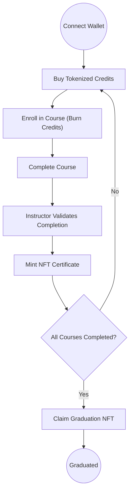

# Presentation.md

---

## Slide 1: Introduction to Education Platform

- Decentralized education management on Solana blockchain
- Automates academic credits, enrollment, and certification
- Ensures transparency, security, and verifiable credentials

---

## Slide 2: Objectives

- Tokenize academic credits with SPL Token-2022
- Automate on-chain course enrollment and progress tracking
- Issue tamper-proof NFT certificates for course completion
- Mint graduation NFT upon fulfillment of requirements

---

## Slide 3: System Architecture

- Solana blockchain network
- Anchor smart contracts managing tokens, enrollments, NFTs
- Web frontend with React, Next.js, wallet adapters
- IPFS for off-chain NFT metadata storage

---

## Slide 4: Student Workflow Overview

---

## Slide 5: Credit Purchase Flow

- User selects credit package
- Wallet transaction to pay SOL/USDC
- Smart contract mints credits tokens to user wallet
- UI updates credit balance in real time

---

## Slide 6: Course Registration Flow

- User selects course from catalog
- Checks credit balance & course credit requirement
- Wallet transaction burns required credits
- Enrollment PDA created on-chain

---

## Slide 7: Course Completion & NFT Certificate

- Instructor marks course as completed on-chain
- Smart contract validates and mints NFT with on-chain metadata
- NFT is sent to student's wallet as verifiable certificate

---

## Slide 8: Graduation NFT Minting

- System checks all required courses completed
- User claims graduation NFT after eligibility confirmation
- Smart contract mints unique graduation NFT linked to student

---

## Slide 9: Security & Benefits

- Immutable on-chain records for all transactions
- Tokens standard SPL Token-2022 for extensibility
- NFTs guarantee tamper-proof credentials
- Low transaction costs & high throughput of Solana
- User wallet control over credentials

---

## Slide 10: Roadmap & Future Enhancements

- Multi-university federation support
- Mobile app integration
- On-chain academic analytics dashboards
- Employer verification & job matching integration
- Cross-chain NFT interoperability

---

## Slide 11: Summary

- Education Platform innovates academic records with blockchain
- Transparent credit system & NFT credentials
- Secure, automated, and globally verifiable academic ecosystem on Solana

---
